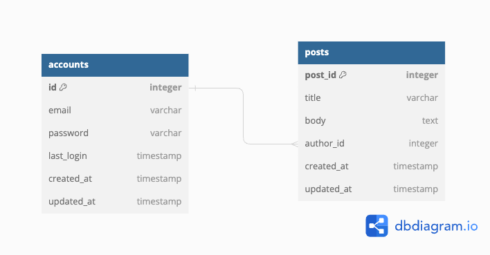

# django-jwt-board-service

- 프로젝트 개발 스택 : Django 4.2.x , Python 3.11.x, MySQL 8.x

## 프로젝트 구조

```shell
.
├── config # 시작 프로젝트
│   ├── __init__.py
│   ├── asgi.py
│   ├── constants.py
│   ├── paginations.py
│   ├── permissions.py
│   ├── renderer.py
│   ├── settings.py
│   ├── urls.py
│   └── wsgi.py
│
├── app # 기능을 담당하는 app 모듈
│   ├── __init__.py
│   └── v1	# api versioning
│       ├── __init__.py
│       ├── accounts	# 회원 계정과 관련된 기능을 담당하는 app
│       │   ├── __init__.py
│       │   ├── __pycache__
│       │   ├── admin.py
│       │   ├── apps.py
│       │   ├── migrations
│       │   ├── models.py
│       │   ├── serializers.py
│       │   ├── tests.py
│       │   ├── validators.py
│       │   └── views.py
│       ├── posts	# 게시글과 관련된 기능을 담당하는 app
│       │   ├── __init__.py
│       │   ├── __pycache__
│       │   ├── admin.py
│       │   ├── apps.py
│       │   ├── migrations
│       │   ├── models.py
│       │   ├── serializers.py
│       │   ├── tests.py
│       │   └── views.py
│       └── urls.py
├── manage.py
├── requirements.txt	# 프로젝트 종속성 설치 리스트
└── wanted-venv		# 파이썬 가상 실행환경
```


## 데이터베이스 테이블 구조



## 실행 방법

### 개발 서버 실행 방법

python3과 mysql이 설치된 상태에서 아래 명령어를 수행한다.

```shell
python -m venv wanted-venv
source wanted-venv/bin/activate
pip install -r requirements.txt
python manage.py migrate
python manage.py runserver
```

기본적으로 8000 포트에 개발서버가 실행될 것이다.

### docker-compose 실행 방법

docker와 docker-compose가 설치되어있어야 한다.

```shell
sudo docker-compose up -d
```

위 명령어를 통하여 배포환경에서  8000번 포트에 백그라운드 실행된다.

### test 실행 방법

```shell
python manage.py test
```

위 명령어를 통하여 app 모듈 내의 테스트를 수행한다. 테스트한 내용은 다음과 같다.

#### account app

- 회원가입
  - api 통합 테스트
    - 회원 가입 완료(비밀번호 암호화)
  - 유닛 테스트
    - validation 만족 못하는 경우
    - 아이디 겹치는 경우
-  로그인
  - api 통합 테스트
    - 성공시 token 발급
  - 유닛 테스트
    - validation 만족 못하는 경우
-  jwt
  - 토큰 인증
  - token refresh

#### post app

- post 작성
  - 글 작성 확인
  - 인증 정보로 author 초기화 확인
- post 리스트
  - 다 보여지는지 확인
  - 10개씩 pagination 
- post 수정
  - 본인이 아닌 다른 사람의 글 수정 불가 확인
  - updated_at 수정되는지 확인
- post 삭제
  - 본인이 아닌 다른 사람의 글 삭제 불가 확인


## api demo video

[구글 드라이브](https://drive.google.com/file/d/1AGOrzRHJPPYp4RVir0zhzbWcfwrUbBHH/view?usp=drive_link)

## api 명세

[postman api documentation](https://documenter.getpostman.com/view/26891658/2s9Xy6rVu3)


## 구현 방법 및 이유에 대한 간략한 설명

1. 구조 설계

   api 버전에 맞게 django app을 관리하기 위해 version별로 모듈을 만들고, 그 안에 앱을 초기화하였다.

2. renderer를 이용한 response 형식 일관화

   response 형식을 `{"code" : 200, "message" : "OK", "data" : { ... } }` 의 형식으로 일관화하기 위해 JSONRenderer를 상속받은 커스텀 renderer를 만들고 등록해주었다.

3. url 설계

   restful로 설계하기 위해 DRF의 DefaultRouter를 이용하여 url 규칙을 만들었다.

4. post 관련 세부 구현

   작성자에 대한 정보를 body에 넣는다면 변조가 가능한 취약한 구조라고 생각하였다. 따라서 header에서 토큰 검증을 통하여 작성자를 파악하고, 이를 serializer의 save가 호출되는 단계에 author로 넣도록 구현하였다.

   permission_classes를 이용하여 인증되지 않았다면 조회만 가능하도록 하고, 수정(PUT)과 삭제(DELETE)에 있어서는 작성자가 본인인 경우에만 허용하도록 custom permission을 구현하였다.

5. 배포 관련 (이슈 포함)

   Dockerfile로 장고 프로젝트를 설정하였고, docker-compose로 DB 컨테이너와 연동하여 실행되도록 작성하였다. 하지만, docker-compose의 장고 컨테이너의 depends_on이 DB로 되어있지만 실행 순서가 동기화되지 않아 DB연결이 안되는 이슈가 발견되었다. 이 경우에는 web container를 재실행하면 되지만, 프로젝트 이후에 느리게 실행되는 DB container의 설정 완료시간을 맞출 방법에 대하여 찾아봐야할 것 같다.

   또한, AWS EC2를 이용하여 배포하였으며 배포환경은 ubuntu이다. docker와 docker-compose를 설치한 후 build하고 백그라운드 실행하였다. 본격적으로 할 때에는 배포환경을 위한 settings와 env를 분리하고, 로그에 대한 고려도 해야할 것이다.

## TODO

- [x] 과제 1. 사용자 회원가입 엔드포인트
  - [x] 이메일과 비밀번호로 회원가입할 수 있는 엔드포인트를 구현해 주세요.
  - [x] 이메일과 비밀번호에 대한 유효성 검사를 구현해 주세요.
  - [x] 이메일 조건: **@** 포함
  - [x] 비밀번호 조건: 8자 이상
  - [x] 비밀번호는 반드시 암호화하여 저장해 주세요.
  - [x] 이메일과 비밀번호의 유효성 검사는 위의 조건만으로 진행해 주세요. 추가적인 유효성 검사 조건은 포함하지 마세요.
- [x] 과제 2. 사용자 로그인 엔드포인트
  - [x] 사용자가 올바른 이메일과 비밀번호를 제공하면, 사용자 인증을 거친 후에 JWT(JSON Web Token)를 생성하여 사용자에게 반환하도록 해주세요.
  - [x] 과제 1과 마찬가지로 회원가입 엔드포인트에 이메일과 비밀번호의 유효성 검사기능을 구현해주세요.
- [x] 과제 3. 새로운 게시글을 생성하는 엔드포인트
- [x] 과제 4. 게시글 목록을 조회하는 엔드포인트
  - [x] 반드시 Pagination 기능을 구현해 주세요.
- [x] 과제 5. 특정 게시글을 조회하는 엔드포인트
  - [x] 게시글의 ID를 받아 해당 게시글을 조회하는 엔드포인트를 구현해 주세요.
- [x] 과제 6. 특정 게시글을 수정하는 엔드포인트
  - [x] 게시글의 ID와 수정 내용을 받아 해당 게시글을 수정하는 엔드포인트를 구현해 주세요.
  - [x] 게시글을 수정할 수 있는 사용자는 게시글 작성자만이어야 합니다.
- [x] 과제 7. 특정 게시글을 삭제하는 엔드포인트
  - [x] 게시글의 ID를 받아 해당 게시글을 삭제하는 엔드포인트를 구현해 주세요.
  - [x] 게시글을 삭제할 수 있는 사용자는 게시글 작성자만이어야 합니다.
- [x] 추가 1. 통합 테스트 또는 단위 테스트 코드
- [x] 추가 2. docker compose를 이용하여 애플리케이션 환경을 구성(README.md 파일에 docker-compose 실행 방법 반드시 기입)
- [x] 추가 3. 클라우드 환경(AWS, GCP)에 배포 환경을 설계하고 애플리케이션을 배포(README.md 파일에 배포된 API 주소와 설계한 AWS 환경 그림으로 첨부)
